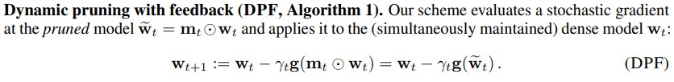
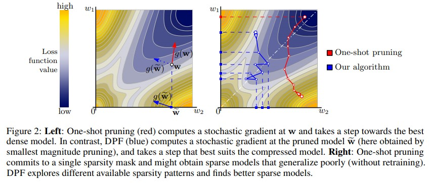
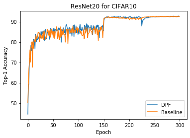
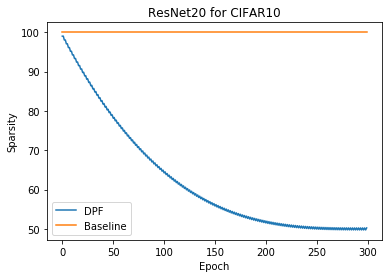

# Dynamic Model Pruning with Feedback

Paper Link : [**Dynamic Model Pruning with Feedback**](https://openreview.net/pdf?id=SJem8lSFwB) - ICLR2020

**It's UNOFFICIAL code!**

If you want to get information of hyperparameters, you should read appendix part of this paper

## Abstract

(1) Allowing dynamic allocation of the sparsity pattern

(2) Incorporating feedback signal to reactivate prematurely pruned weights

## Method






## Run

```
python train.py --data cifar10 --datapath DATAPATH --model resnet20 --expname DPFTest
```

## Experiment

 

|         | Best Top-1 Acc | Sparsity(%) |
| ------- | -------------- | ----------- |
| Basline | 92.66          | 0           |
| DPF     | **92.78**      | **45.75**   |


Experiment on ResNet20 for CIFAR10

DPF run :

```
python train.py --data cifar10 --datapath DATAPATH --model resnet20 --expname DPFTest --epochs 300 --batch_size 128 --lr 0.2 --nesterov --lr_decay 0.1 --weight_decay 1e-4 --do-DPF -- target_sparsity 0.5 --frequency 1
```